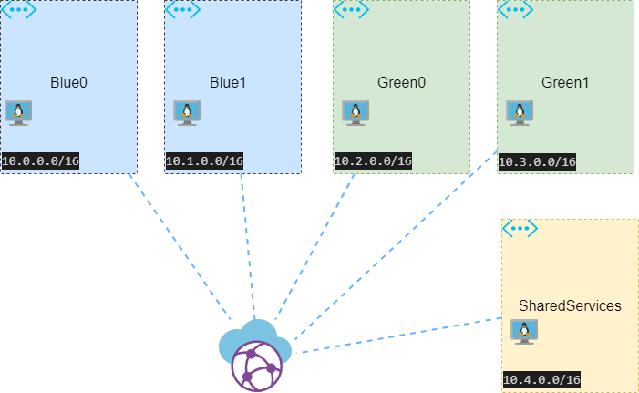
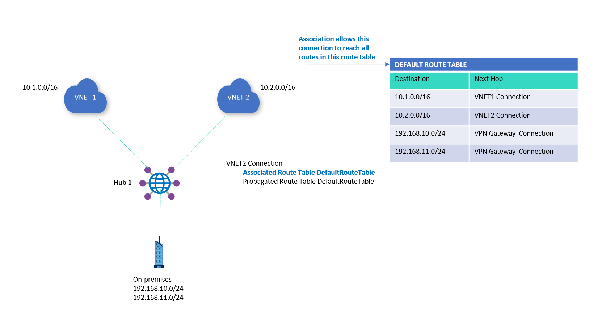
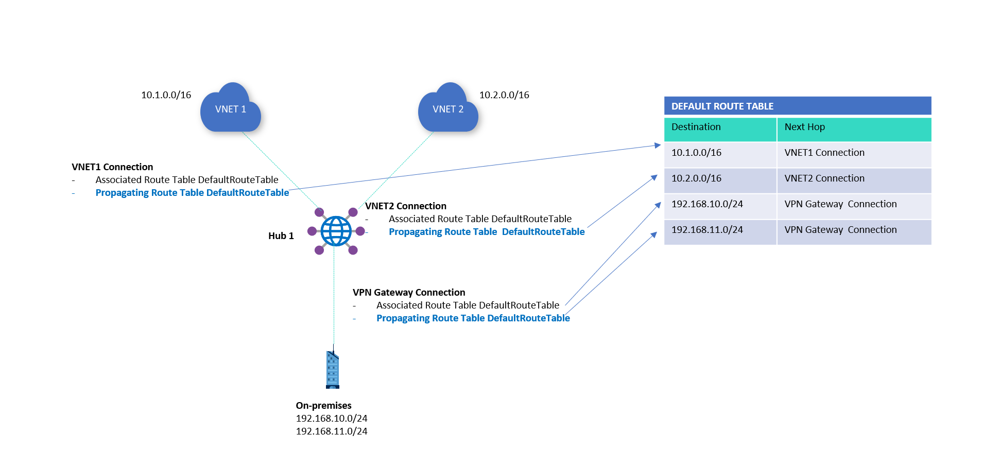
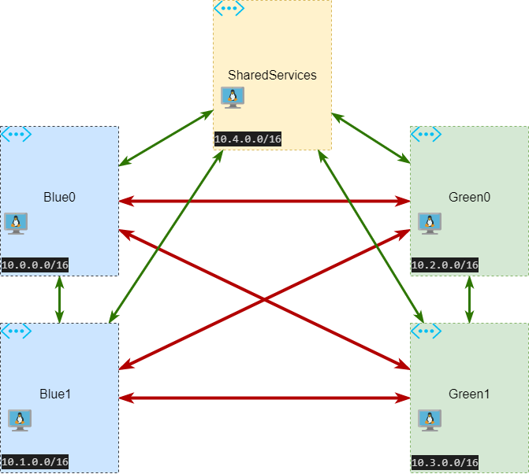
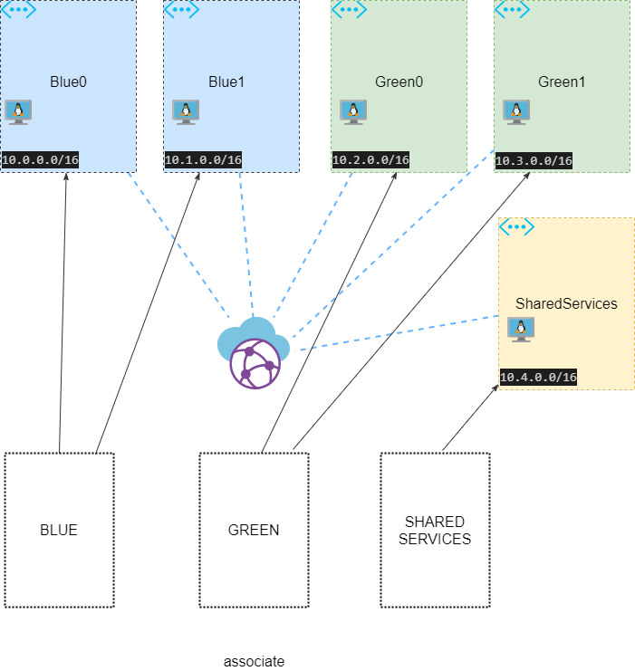
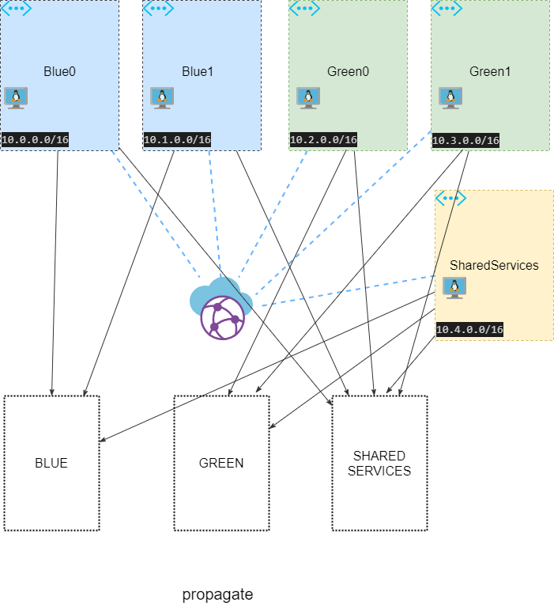
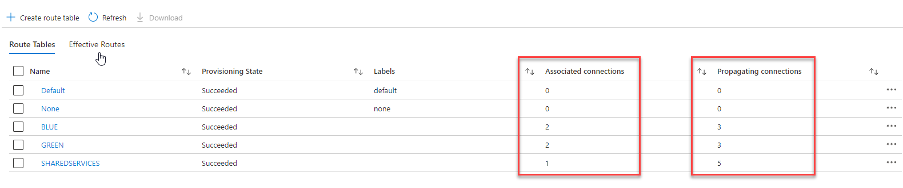
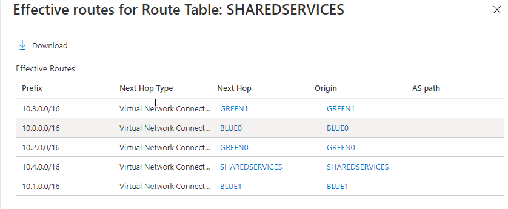
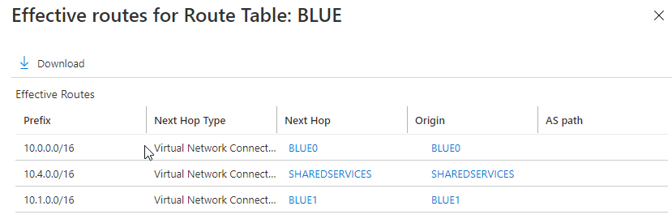
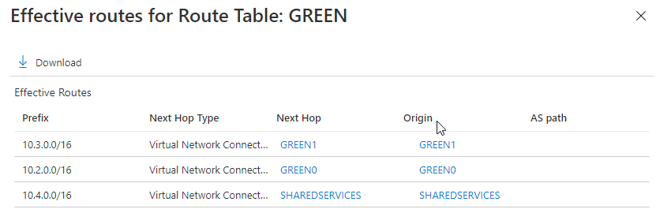

# Shared Services and VNET Isolation for VWAN

## Introduction

A variety of routing scenarios are available when using Virtual WAN virtual hubs. The goal of a custom isolation scenario for VNets is to ensure that specific VNets do not communicate with each other. However, all VNets are required to reach the Shared Services VNET.

VWan native capabilities were used in this lab to create a topology that implemented above requirements without using NSG. 

You can obtain enough background information by visiting the official Microsoft Docs links below. 

* [Isolating VNets](https://docs.microsoft.com/en-us/azure/virtual-wan/scenario-isolate-vnets)
* [About Virtual Hub Routing](https://docs.microsoft.com/en-us/azure/virtual-wan/about-virtual-hub-routing)
* [Isolate Virtual Network Branches](https://docs.microsoft.com/en-us/azure/virtual-wan/scenario-isolate-virtual-networks-branches)
* [Custom Isolation for VNETs](https://docs.microsoft.com/en-us/azure/virtual-wan/scenario-isolate-vnets-custom)

## Infrastructure deployment

The lab topology consists of five VNETs; two are classified as Blue VNETs, two as Green VNETs, and one as Shared Services. Blue and Green should not be allowed to communicate with each other, but should communicate with Shared Services. Any communication within the same color should be allowed. (e.g. Blue0 to Blue1. )

The deployment topology looks like this:




To create the above topology, run the following set of commands:

```bash
function connectivity_check {
    public_ips=`az vm list-ip-addresses -g ${rg} --query "[].virtualMachine.network.publicIpAddresses[].ipAddress" -o tsv`
    private_ips=`az vm list-ip-addresses -g ${rg} --query "[].virtualMachine.network.privateIpAddresses" -o tsv`

    for public_ip in $public_ips; do
        echo "--------------------${public_ip}----------------------------------------"
        for private_ip in $private_ips; do
            echo "--------------------${private_ip}"
            ssh -o StrictHostKeyChecking=no azureadmin@$public_ip ping -c 4 $private_ip
        done
    done
}

az login
az account set

export rg="VWAN001"
export vwan_name="VWAN"
export location="eastus2"
export vhub0_name="eastus2"

az group create --name ${rg} --location ${location}

echo "Creating VWAN and VHUB"

az network vwan create --name ${vwan_name} --resource-group ${rg} --type Standard --location ${location}

az network vhub create --address-prefix 10.100.0.0/24 \
                        --name ${vhub0_name} \
                        --resource-group ${rg} \
                        --vwan ${vwan_name}   

echo "Creating Workload VNETs and Shared Services"
                        
az network vnet create --name "BLUE0" \
                        --resource-group ${rg} \
                        --address-prefixes 10.0.0.0/16 \
                        --subnet-name default \
                        --subnet-prefixes 10.0.1.0/24 \
                        --location ${location}


az network vnet create --name "BLUE1" \
                        --resource-group ${rg} \
                        --address-prefixes 10.1.0.0/16 \
                        --subnet-name default \
                        --subnet-prefixes 10.1.1.0/24 \
                        --location ${location}

az network vnet create --name "GREEN0" \
                        --resource-group ${rg} \
                        --address-prefixes 10.2.0.0/16 \
                        --subnet-name default \
                        --subnet-prefixes 10.2.1.0/24 \
                        --location ${location}

az network vnet create --name "GREEN1" \
                        --resource-group ${rg} \
                        --address-prefixes 10.3.0.0/16 \
                        --subnet-name default \
                        --subnet-prefixes 10.3.1.0/24 \
                        --location ${location}

az network vnet create --name "SHAREDSERVICES" \
                        --resource-group ${rg} \
                        --address-prefixes 10.4.0.0/16 \
                        --subnet-name default \
                        --subnet-prefixes 10.4.1.0/24 \
                        --location ${location}


echo "Create VM for testing"

for vnet in BLUE0 BLUE1 GREEN0 GREEN1 SHAREDSERVICES; do \

    az vm create --resource-group ${rg} \
                                --name "${vnet}VM" \
                                --image UbuntuLTS \
                                --vnet-name $vnet \
                                --subnet default \
                                --admin-username azureadmin \
                                --public-ip-sku Standard \
                                --ssh-key-values @~/.ssh/id_rsa.pub \
                                --nsg-rule SSH 
done
```

We use the concept of routing tables in order to achieve isolation. Here is the full definition of Association and Propagation from the official documentation: ( [About virtual hub routing - Azure Virtual WAN | Microsoft Docs](https://docs.microsoft.com/en-us/azure/virtual-wan/about-virtual-hub-routing) )

**Association**

Each connection is associated to one route table. Associating a connection to a route table allows the traffic to be sent to the destination indicated as routes in the route table. The routing configuration of the connection will show the associated route table. Multiple connections can be associated to the same route table. All VPN, ExpressRoute, and User VPN connections are associated to the same (default) route table.

By default, all connections are associated to a Default route table in a virtual hub. Each virtual hub has its own Default route table, which can be edited to add a static route(s). Routes added statically take precedence over dynamically learned routes for the same prefixes.



**Propagation**

Connections dynamically propagate routes to a route table. With a VPN connection, ExpressRoute connection, or P2S configuration connection, routes are propagated from the virtual hub to the on-premises router using BGP. Routes can be propagated to one or multiple route tables.

A None route table is also available for each virtual hub. Propagating to the None route table implies that no routes are required to be propagated from the connection. VPN, ExpressRoute, and User VPN connections propagate routes to the same set of route tables.



Target flow matrix should look like following :




Use commands below to create full-mesh ( no restriction of connectivigty )

```bash

echo "Create Route Tables"

az network vhub route-table create --name BLUE \
                                    --resource-group ${rg} \
                                    --vhub-name ${vhub0_name}
                                    

az network vhub route-table create --name GREEN \
                                    --resource-group ${rg} \
                                    --vhub-name ${vhub0_name}


az network vhub route-table create --name SHAREDSERVICES \
                                    --resource-group ${rg} \
                                    --vhub-name ${vhub0_name}

echo "Creating full mesh"

ss_rtid=`az network vhub route-table show --name SHAREDSERVICES -g ${rg} --vhub-name ${vhub0_name} --query "id" -o tsv`
blue_rtid=`az network vhub route-table show --name BLUE -g ${rg} --vhub-name ${vhub0_name} --query "id" -o tsv`
green_rtid=`az network vhub route-table show --name GREEN -g ${rg} --vhub-name ${vhub0_name} --query "id" -o tsv`

az network vhub connection create --name SHAREDSERVICES \
                                    --remote-vnet SHAREDSERVICES \
                                    --resource-group ${rg} \
                                    --vhub-name ${vhub0_name} \
                                    --associated-route-table ${ss_rtid}\
                                    --propagated-route-tables ${ss_rtid} ${blue_rtid} ${green_rtid}

for color in BLUE GREEN ; do
    for id in 0 1 ; do 
        vnet="${color}${id}"
        rtid=`az network vhub route-table show --name ${color} -g ${rg} --vhub-name ${vhub0_name} --query "id" -o tsv`
        az network vhub connection create --name ${vnet} \
                                            --remote-vnet "${vnet}" \
                                            --resource-group ${rg} \
                                            --vhub-name ${vhub0_name} \
                                            --associated-route-table ${rtid} \
                                            --propagated-route-tables ${ss_rtid} ${blue_rtid} ${green_rtid}
    done
done
```

Verifying connectivity ( all flows are allowed ):

```bash
$ connectivity_check
--------------------20.85.67.2----------------------------------------
--------------------10.0.1.4
PING 10.0.1.4 (10.0.1.4) 56(84) bytes of data.
64 bytes from 10.0.1.4: icmp_seq=1 ttl=64 time=0.033 ms
64 bytes from 10.0.1.4: icmp_seq=2 ttl=64 time=0.052 ms
64 bytes from 10.0.1.4: icmp_seq=3 ttl=64 time=0.056 ms
64 bytes from 10.0.1.4: icmp_seq=4 ttl=64 time=0.056 ms

--- 10.0.1.4 ping statistics ---
4 packets transmitted, 4 received, 0% packet loss, time 3070ms
rtt min/avg/max/mdev = 0.033/0.049/0.056/0.010 ms
--------------------10.1.1.4
PING 10.1.1.4 (10.1.1.4) 56(84) bytes of data.
64 bytes from 10.1.1.4: icmp_seq=1 ttl=63 time=5.62 ms
64 bytes from 10.1.1.4: icmp_seq=2 ttl=63 time=2.35 ms
64 bytes from 10.1.1.4: icmp_seq=3 ttl=63 time=2.43 ms
64 bytes from 10.1.1.4: icmp_seq=4 ttl=63 time=5.32 ms

--- 10.1.1.4 ping statistics ---
4 packets transmitted, 4 received, 0% packet loss, time 3005ms
rtt min/avg/max/mdev = 2.356/3.932/5.622/1.543 ms
--------------------10.2.1.4
PING 10.2.1.4 (10.2.1.4) 56(84) bytes of data.
64 bytes from 10.2.1.4: icmp_seq=1 ttl=63 time=4.86 ms
64 bytes from 10.2.1.4: icmp_seq=2 ttl=63 time=2.54 ms
64 bytes from 10.2.1.4: icmp_seq=3 ttl=63 time=2.33 ms
64 bytes from 10.2.1.4: icmp_seq=4 ttl=63 time=4.49 ms

--- 10.2.1.4 ping statistics ---
4 packets transmitted, 4 received, 0% packet loss, time 3005ms
rtt min/avg/max/mdev = 2.337/3.562/4.869/1.133 ms
--------------------10.3.1.4
PING 10.3.1.4 (10.3.1.4) 56(84) bytes of data.
64 bytes from 10.3.1.4: icmp_seq=1 ttl=63 time=3.12 ms
64 bytes from 10.3.1.4: icmp_seq=2 ttl=63 time=3.02 ms
64 bytes from 10.3.1.4: icmp_seq=3 ttl=63 time=3.42 ms
64 bytes from 10.3.1.4: icmp_seq=4 ttl=63 time=2.44 ms

--- 10.3.1.4 ping statistics ---
4 packets transmitted, 4 received, 0% packet loss, time 3004ms
rtt min/avg/max/mdev = 2.443/3.004/3.422/0.355 ms
--------------------10.4.1.4
PING 10.4.1.4 (10.4.1.4) 56(84) bytes of data.
64 bytes from 10.4.1.4: icmp_seq=1 ttl=63 time=4.97 ms
64 bytes from 10.4.1.4: icmp_seq=2 ttl=63 time=2.73 ms
64 bytes from 10.4.1.4: icmp_seq=3 ttl=63 time=3.19 ms
64 bytes from 10.4.1.4: icmp_seq=4 ttl=63 time=2.98 ms

--- 10.4.1.4 ping statistics ---
4 packets transmitted, 4 received, 0% packet loss, time 3004ms
rtt min/avg/max/mdev = 2.735/3.471/4.972/0.883 ms
--------------------20.85.65.52----------------------------------------
--------------------10.0.1.4
PING 10.0.1.4 (10.0.1.4) 56(84) bytes of data.
64 bytes from 10.0.1.4: icmp_seq=1 ttl=63 time=2.56 ms
64 bytes from 10.0.1.4: icmp_seq=2 ttl=63 time=2.30 ms
64 bytes from 10.0.1.4: icmp_seq=3 ttl=63 time=2.84 ms
64 bytes from 10.0.1.4: icmp_seq=4 ttl=63 time=2.40 ms

--- 10.0.1.4 ping statistics ---
4 packets transmitted, 4 received, 0% packet loss, time 3005ms
rtt min/avg/max/mdev = 2.300/2.530/2.844/0.207 ms
--------------------10.1.1.4
PING 10.1.1.4 (10.1.1.4) 56(84) bytes of data.
64 bytes from 10.1.1.4: icmp_seq=1 ttl=64 time=0.021 ms
64 bytes from 10.1.1.4: icmp_seq=2 ttl=64 time=0.054 ms
64 bytes from 10.1.1.4: icmp_seq=3 ttl=64 time=0.046 ms
64 bytes from 10.1.1.4: icmp_seq=4 ttl=64 time=0.054 ms

--- 10.1.1.4 ping statistics ---
4 packets transmitted, 4 received, 0% packet loss, time 3052ms
rtt min/avg/max/mdev = 0.021/0.043/0.054/0.015 ms
--------------------10.2.1.4
PING 10.2.1.4 (10.2.1.4) 56(84) bytes of data.
64 bytes from 10.2.1.4: icmp_seq=1 ttl=63 time=4.74 ms
64 bytes from 10.2.1.4: icmp_seq=2 ttl=63 time=2.90 ms
64 bytes from 10.2.1.4: icmp_seq=3 ttl=63 time=3.39 ms
64 bytes from 10.2.1.4: icmp_seq=4 ttl=63 time=3.01 ms

--- 10.2.1.4 ping statistics ---
4 packets transmitted, 4 received, 0% packet loss, time 3004ms
rtt min/avg/max/mdev = 2.909/3.515/4.744/0.733 ms
--------------------10.3.1.4
PING 10.3.1.4 (10.3.1.4) 56(84) bytes of data.
64 bytes from 10.3.1.4: icmp_seq=1 ttl=63 time=5.18 ms
64 bytes from 10.3.1.4: icmp_seq=2 ttl=63 time=2.47 ms
64 bytes from 10.3.1.4: icmp_seq=3 ttl=63 time=4.89 ms
64 bytes from 10.3.1.4: icmp_seq=4 ttl=63 time=2.26 ms

--- 10.3.1.4 ping statistics ---
4 packets transmitted, 4 received, 0% packet loss, time 3004ms
rtt min/avg/max/mdev = 2.263/3.705/5.184/1.341 ms
--------------------10.4.1.4
PING 10.4.1.4 (10.4.1.4) 56(84) bytes of data.
64 bytes from 10.4.1.4: icmp_seq=1 ttl=63 time=4.34 ms
64 bytes from 10.4.1.4: icmp_seq=2 ttl=63 time=2.38 ms
64 bytes from 10.4.1.4: icmp_seq=3 ttl=63 time=3.15 ms
64 bytes from 10.4.1.4: icmp_seq=4 ttl=63 time=2.78 ms

--- 10.4.1.4 ping statistics ---
4 packets transmitted, 4 received, 0% packet loss, time 3004ms
rtt min/avg/max/mdev = 2.381/3.166/4.342/0.734 ms
--------------------20.85.68.175----------------------------------------
--------------------10.0.1.4
PING 10.0.1.4 (10.0.1.4) 56(84) bytes of data.
64 bytes from 10.0.1.4: icmp_seq=1 ttl=63 time=4.90 ms
64 bytes from 10.0.1.4: icmp_seq=2 ttl=63 time=5.00 ms
64 bytes from 10.0.1.4: icmp_seq=3 ttl=63 time=3.51 ms
64 bytes from 10.0.1.4: icmp_seq=4 ttl=63 time=2.81 ms

--- 10.0.1.4 ping statistics ---
4 packets transmitted, 4 received, 0% packet loss, time 3004ms
rtt min/avg/max/mdev = 2.817/4.061/5.009/0.932 ms
--------------------10.1.1.4
PING 10.1.1.4 (10.1.1.4) 56(84) bytes of data.
64 bytes from 10.1.1.4: icmp_seq=1 ttl=63 time=3.39 ms
64 bytes from 10.1.1.4: icmp_seq=2 ttl=63 time=4.31 ms
64 bytes from 10.1.1.4: icmp_seq=3 ttl=63 time=2.74 ms
64 bytes from 10.1.1.4: icmp_seq=4 ttl=63 time=2.29 ms

--- 10.1.1.4 ping statistics ---
4 packets transmitted, 4 received, 0% packet loss, time 3005ms
rtt min/avg/max/mdev = 2.292/3.186/4.311/0.758 ms
--------------------10.2.1.4
PING 10.2.1.4 (10.2.1.4) 56(84) bytes of data.
64 bytes from 10.2.1.4: icmp_seq=1 ttl=64 time=0.032 ms
64 bytes from 10.2.1.4: icmp_seq=2 ttl=64 time=0.054 ms
64 bytes from 10.2.1.4: icmp_seq=3 ttl=64 time=0.056 ms
64 bytes from 10.2.1.4: icmp_seq=4 ttl=64 time=0.055 ms

--- 10.2.1.4 ping statistics ---
4 packets transmitted, 4 received, 0% packet loss, time 3057ms
rtt min/avg/max/mdev = 0.032/0.049/0.056/0.011 ms
--------------------10.3.1.4
PING 10.3.1.4 (10.3.1.4) 56(84) bytes of data.
64 bytes from 10.3.1.4: icmp_seq=1 ttl=63 time=3.31 ms
64 bytes from 10.3.1.4: icmp_seq=2 ttl=63 time=2.82 ms
64 bytes from 10.3.1.4: icmp_seq=3 ttl=63 time=2.39 ms
64 bytes from 10.3.1.4: icmp_seq=4 ttl=63 time=2.59 ms

--- 10.3.1.4 ping statistics ---
4 packets transmitted, 4 received, 0% packet loss, time 3004ms
rtt min/avg/max/mdev = 2.394/2.782/3.319/0.351 ms
--------------------10.4.1.4
PING 10.4.1.4 (10.4.1.4) 56(84) bytes of data.
64 bytes from 10.4.1.4: icmp_seq=1 ttl=63 time=3.31 ms
64 bytes from 10.4.1.4: icmp_seq=2 ttl=63 time=2.90 ms
64 bytes from 10.4.1.4: icmp_seq=3 ttl=63 time=2.18 ms
64 bytes from 10.4.1.4: icmp_seq=4 ttl=63 time=2.73 ms

--- 10.4.1.4 ping statistics ---
4 packets transmitted, 4 received, 0% packet loss, time 3004ms
rtt min/avg/max/mdev = 2.186/2.787/3.315/0.405 ms
--------------------20.85.66.108----------------------------------------
--------------------10.0.1.4
PING 10.0.1.4 (10.0.1.4) 56(84) bytes of data.
64 bytes from 10.0.1.4: icmp_seq=1 ttl=63 time=8.23 ms
64 bytes from 10.0.1.4: icmp_seq=2 ttl=63 time=2.71 ms
64 bytes from 10.0.1.4: icmp_seq=3 ttl=63 time=2.70 ms
64 bytes from 10.0.1.4: icmp_seq=4 ttl=63 time=2.83 ms

--- 10.0.1.4 ping statistics ---
4 packets transmitted, 4 received, 0% packet loss, time 3005ms
rtt min/avg/max/mdev = 2.705/4.122/8.233/2.374 ms
--------------------10.1.1.4
PING 10.1.1.4 (10.1.1.4) 56(84) bytes of data.
64 bytes from 10.1.1.4: icmp_seq=1 ttl=63 time=3.98 ms
64 bytes from 10.1.1.4: icmp_seq=2 ttl=63 time=2.41 ms
64 bytes from 10.1.1.4: icmp_seq=3 ttl=63 time=2.74 ms
64 bytes from 10.1.1.4: icmp_seq=4 ttl=63 time=3.98 ms

--- 10.1.1.4 ping statistics ---
4 packets transmitted, 4 received, 0% packet loss, time 3004ms
rtt min/avg/max/mdev = 2.413/3.282/3.985/0.711 ms
--------------------10.2.1.4
PING 10.2.1.4 (10.2.1.4) 56(84) bytes of data.
64 bytes from 10.2.1.4: icmp_seq=1 ttl=63 time=3.47 ms
64 bytes from 10.2.1.4: icmp_seq=2 ttl=63 time=2.56 ms
64 bytes from 10.2.1.4: icmp_seq=3 ttl=63 time=2.32 ms
64 bytes from 10.2.1.4: icmp_seq=4 ttl=63 time=3.46 ms

--- 10.2.1.4 ping statistics ---
4 packets transmitted, 4 received, 0% packet loss, time 3005ms
rtt min/avg/max/mdev = 2.329/2.960/3.477/0.521 ms
--------------------10.3.1.4
PING 10.3.1.4 (10.3.1.4) 56(84) bytes of data.
64 bytes from 10.3.1.4: icmp_seq=1 ttl=64 time=0.031 ms
64 bytes from 10.3.1.4: icmp_seq=2 ttl=64 time=0.055 ms
64 bytes from 10.3.1.4: icmp_seq=3 ttl=64 time=0.054 ms
64 bytes from 10.3.1.4: icmp_seq=4 ttl=64 time=0.045 ms

--- 10.3.1.4 ping statistics ---
4 packets transmitted, 4 received, 0% packet loss, time 3066ms
rtt min/avg/max/mdev = 0.031/0.046/0.055/0.010 ms
--------------------10.4.1.4
PING 10.4.1.4 (10.4.1.4) 56(84) bytes of data.
64 bytes from 10.4.1.4: icmp_seq=1 ttl=63 time=2.24 ms
64 bytes from 10.4.1.4: icmp_seq=2 ttl=63 time=2.68 ms
64 bytes from 10.4.1.4: icmp_seq=3 ttl=63 time=2.18 ms
64 bytes from 10.4.1.4: icmp_seq=4 ttl=63 time=2.41 ms

--- 10.4.1.4 ping statistics ---
4 packets transmitted, 4 received, 0% packet loss, time 3004ms
rtt min/avg/max/mdev = 2.181/2.379/2.681/0.196 ms
--------------------20.85.66.115----------------------------------------
--------------------10.0.1.4
PING 10.0.1.4 (10.0.1.4) 56(84) bytes of data.
64 bytes from 10.0.1.4: icmp_seq=1 ttl=63 time=4.45 ms
64 bytes from 10.0.1.4: icmp_seq=2 ttl=63 time=5.47 ms
64 bytes from 10.0.1.4: icmp_seq=3 ttl=63 time=3.55 ms
64 bytes from 10.0.1.4: icmp_seq=4 ttl=63 time=3.23 ms

--- 10.0.1.4 ping statistics ---
4 packets transmitted, 4 received, 0% packet loss, time 3005ms
rtt min/avg/max/mdev = 3.237/4.181/5.479/0.876 ms
--------------------10.1.1.4
PING 10.1.1.4 (10.1.1.4) 56(84) bytes of data.
64 bytes from 10.1.1.4: icmp_seq=1 ttl=63 time=4.66 ms
64 bytes from 10.1.1.4: icmp_seq=2 ttl=63 time=3.79 ms
64 bytes from 10.1.1.4: icmp_seq=3 ttl=63 time=2.11 ms
64 bytes from 10.1.1.4: icmp_seq=4 ttl=63 time=3.36 ms

--- 10.1.1.4 ping statistics ---
4 packets transmitted, 4 received, 0% packet loss, time 3005ms
rtt min/avg/max/mdev = 2.115/3.485/4.665/0.922 ms
--------------------10.2.1.4
PING 10.2.1.4 (10.2.1.4) 56(84) bytes of data.
64 bytes from 10.2.1.4: icmp_seq=1 ttl=63 time=3.04 ms
64 bytes from 10.2.1.4: icmp_seq=2 ttl=63 time=3.18 ms
64 bytes from 10.2.1.4: icmp_seq=3 ttl=63 time=2.84 ms
64 bytes from 10.2.1.4: icmp_seq=4 ttl=63 time=2.84 ms

--- 10.2.1.4 ping statistics ---
4 packets transmitted, 4 received, 0% packet loss, time 3003ms
rtt min/avg/max/mdev = 2.841/2.979/3.188/0.149 ms
--------------------10.3.1.4
PING 10.3.1.4 (10.3.1.4) 56(84) bytes of data.
64 bytes from 10.3.1.4: icmp_seq=1 ttl=63 time=1.93 ms
64 bytes from 10.3.1.4: icmp_seq=2 ttl=63 time=3.05 ms
64 bytes from 10.3.1.4: icmp_seq=3 ttl=63 time=2.88 ms
64 bytes from 10.3.1.4: icmp_seq=4 ttl=63 time=2.78 ms

--- 10.3.1.4 ping statistics ---
4 packets transmitted, 4 received, 0% packet loss, time 3003ms
rtt min/avg/max/mdev = 1.935/2.666/3.055/0.437 ms
--------------------10.4.1.4
PING 10.4.1.4 (10.4.1.4) 56(84) bytes of data.
64 bytes from 10.4.1.4: icmp_seq=1 ttl=64 time=0.032 ms
64 bytes from 10.4.1.4: icmp_seq=2 ttl=64 time=0.055 ms
64 bytes from 10.4.1.4: icmp_seq=3 ttl=64 time=0.054 ms
64 bytes from 10.4.1.4: icmp_seq=4 ttl=64 time=0.054 ms

--- 10.4.1.4 ping statistics ---
4 packets transmitted, 4 received, 0% packet loss, time 3068ms
rtt min/avg/max/mdev = 0.032/0.048/0.055/0.012 ms

```

Isolation may be achieved by selectively making 'propagate' / 'associate' connections as explained in the diagram:




```bash

echo "Creating isolation:"

ss_rtid=`az network vhub route-table show --name SHAREDSERVICES -g ${rg} --vhub-name ${vhub0_name} --query "id" -o tsv`
blue_rtid=`az network vhub route-table show --name BLUE -g ${rg} --vhub-name ${vhub0_name} --query "id" -o tsv`
green_rtid=`az network vhub route-table show --name GREEN -g ${rg} --vhub-name ${vhub0_name} --query "id" -o tsv`

az network vhub connection create --name SHAREDSERVICES \
                                    --remote-vnet SHAREDSERVICES \
                                    --resource-group ${rg} \
                                    --vhub-name ${vhub0_name} \
                                    --associated-route-table ${ss_rtid} \
                                    --propagated-route-tables ${ss_rtid} ${blue_rtid} ${green_rtid}

for color in BLUE GREEN ; do

    rt=${color}
    rtid=`az network vhub route-table show --name $rt -g ${rg} --vhub-name ${vhub0_name} --query "id" -o tsv`

    for id in 0 1 ; do 

        vnet="${color}${id}"

        echo $vnet $rt $rtid

        #az network vhub connection delete --name ${vnet} -g ${rg} --vhub-name ${vhub0_name} --yes

        az network vhub connection create --name ${vnet} \
                                            --remote-vnet "${vnet}" \
                                            --resource-group ${rg} \
                                            --vhub-name ${vhub0_name} \
                                            --associated-route-table ${rtid} \
                                            --propagated-route-tables ${rtid} ${ss_rtid}

    done

done
```

Verifying connectivity :

```bash

n$ connectivity_check
--------------------20.85.67.2----------------------------------------
--------------------10.0.1.4
PING 10.0.1.4 (10.0.1.4) 56(84) bytes of data.
64 bytes from 10.0.1.4: icmp_seq=1 ttl=64 time=0.021 ms
64 bytes from 10.0.1.4: icmp_seq=2 ttl=64 time=0.055 ms
64 bytes from 10.0.1.4: icmp_seq=3 ttl=64 time=0.053 ms
64 bytes from 10.0.1.4: icmp_seq=4 ttl=64 time=0.054 ms

--- 10.0.1.4 ping statistics ---
4 packets transmitted, 4 received, 0% packet loss, time 3055ms
rtt min/avg/max/mdev = 0.021/0.045/0.055/0.016 ms
--------------------10.1.1.4
PING 10.1.1.4 (10.1.1.4) 56(84) bytes of data.
64 bytes from 10.1.1.4: icmp_seq=1 ttl=63 time=5.23 ms
64 bytes from 10.1.1.4: icmp_seq=2 ttl=63 time=2.59 ms
64 bytes from 10.1.1.4: icmp_seq=3 ttl=63 time=2.82 ms
64 bytes from 10.1.1.4: icmp_seq=4 ttl=63 time=2.63 ms

--- 10.1.1.4 ping statistics ---
4 packets transmitted, 4 received, 0% packet loss, time 3004ms
rtt min/avg/max/mdev = 2.594/3.322/5.235/1.109 ms
--------------------10.2.1.4
PING 10.2.1.4 (10.2.1.4) 56(84) bytes of data.

--- 10.2.1.4 ping statistics ---
4 packets transmitted, 0 received, 100% packet loss, time 3054ms

--------------------10.3.1.4
PING 10.3.1.4 (10.3.1.4) 56(84) bytes of data.

--- 10.3.1.4 ping statistics ---
4 packets transmitted, 0 received, 100% packet loss, time 3072ms

--------------------10.4.1.4
PING 10.4.1.4 (10.4.1.4) 56(84) bytes of data.
64 bytes from 10.4.1.4: icmp_seq=1 ttl=63 time=5.22 ms
64 bytes from 10.4.1.4: icmp_seq=2 ttl=63 time=1.86 ms
64 bytes from 10.4.1.4: icmp_seq=3 ttl=63 time=2.79 ms
64 bytes from 10.4.1.4: icmp_seq=4 ttl=63 time=2.40 ms

--- 10.4.1.4 ping statistics ---
4 packets transmitted, 4 received, 0% packet loss, time 3005ms
rtt min/avg/max/mdev = 1.866/3.071/5.221/1.285 ms
--------------------20.85.65.52----------------------------------------
--------------------10.0.1.4
PING 10.0.1.4 (10.0.1.4) 56(84) bytes of data.
64 bytes from 10.0.1.4: icmp_seq=1 ttl=63 time=5.93 ms
64 bytes from 10.0.1.4: icmp_seq=2 ttl=63 time=2.69 ms
64 bytes from 10.0.1.4: icmp_seq=3 ttl=63 time=2.48 ms
64 bytes from 10.0.1.4: icmp_seq=4 ttl=63 time=4.75 ms

--- 10.0.1.4 ping statistics ---
4 packets transmitted, 4 received, 0% packet loss, time 3004ms
rtt min/avg/max/mdev = 2.482/3.966/5.931/1.441 ms
--------------------10.1.1.4
PING 10.1.1.4 (10.1.1.4) 56(84) bytes of data.
64 bytes from 10.1.1.4: icmp_seq=1 ttl=64 time=0.031 ms
64 bytes from 10.1.1.4: icmp_seq=2 ttl=64 time=0.046 ms
64 bytes from 10.1.1.4: icmp_seq=3 ttl=64 time=0.053 ms
64 bytes from 10.1.1.4: icmp_seq=4 ttl=64 time=0.045 ms

--- 10.1.1.4 ping statistics ---
4 packets transmitted, 4 received, 0% packet loss, time 3072ms
rtt min/avg/max/mdev = 0.031/0.043/0.053/0.011 ms
--------------------10.2.1.4
PING 10.2.1.4 (10.2.1.4) 56(84) bytes of data.

--- 10.2.1.4 ping statistics ---
4 packets transmitted, 0 received, 100% packet loss, time 3048ms

--------------------10.3.1.4
PING 10.3.1.4 (10.3.1.4) 56(84) bytes of data.

--- 10.3.1.4 ping statistics ---
4 packets transmitted, 0 received, 100% packet loss, time 3063ms

--------------------10.4.1.4
PING 10.4.1.4 (10.4.1.4) 56(84) bytes of data.
64 bytes from 10.4.1.4: icmp_seq=1 ttl=63 time=4.89 ms
64 bytes from 10.4.1.4: icmp_seq=2 ttl=63 time=2.17 ms
64 bytes from 10.4.1.4: icmp_seq=3 ttl=63 time=2.91 ms
64 bytes from 10.4.1.4: icmp_seq=4 ttl=63 time=2.82 ms

--- 10.4.1.4 ping statistics ---
4 packets transmitted, 4 received, 0% packet loss, time 3004ms
rtt min/avg/max/mdev = 2.178/3.203/4.896/1.018 ms
--------------------20.85.68.175----------------------------------------
--------------------10.0.1.4
PING 10.0.1.4 (10.0.1.4) 56(84) bytes of data.

--- 10.0.1.4 ping statistics ---
4 packets transmitted, 0 received, 100% packet loss, time 3055ms

--------------------10.1.1.4
PING 10.1.1.4 (10.1.1.4) 56(84) bytes of data.

--- 10.1.1.4 ping statistics ---
4 packets transmitted, 0 received, 100% packet loss, time 3064ms

--------------------10.2.1.4
PING 10.2.1.4 (10.2.1.4) 56(84) bytes of data.
64 bytes from 10.2.1.4: icmp_seq=1 ttl=64 time=0.035 ms
64 bytes from 10.2.1.4: icmp_seq=2 ttl=64 time=0.056 ms
64 bytes from 10.2.1.4: icmp_seq=3 ttl=64 time=0.049 ms
64 bytes from 10.2.1.4: icmp_seq=4 ttl=64 time=0.055 ms

--- 10.2.1.4 ping statistics ---
4 packets transmitted, 4 received, 0% packet loss, time 3048ms
rtt min/avg/max/mdev = 0.035/0.048/0.056/0.011 ms
--------------------10.3.1.4
PING 10.3.1.4 (10.3.1.4) 56(84) bytes of data.
64 bytes from 10.3.1.4: icmp_seq=1 ttl=63 time=5.01 ms
64 bytes from 10.3.1.4: icmp_seq=2 ttl=63 time=2.26 ms
64 bytes from 10.3.1.4: icmp_seq=3 ttl=63 time=2.17 ms
64 bytes from 10.3.1.4: icmp_seq=4 ttl=63 time=2.56 ms

--- 10.3.1.4 ping statistics ---
4 packets transmitted, 4 received, 0% packet loss, time 3004ms
rtt min/avg/max/mdev = 2.171/3.006/5.018/1.170 ms
--------------------10.4.1.4
PING 10.4.1.4 (10.4.1.4) 56(84) bytes of data.
64 bytes from 10.4.1.4: icmp_seq=1 ttl=63 time=4.18 ms
64 bytes from 10.4.1.4: icmp_seq=2 ttl=63 time=2.38 ms
64 bytes from 10.4.1.4: icmp_seq=3 ttl=63 time=2.76 ms
64 bytes from 10.4.1.4: icmp_seq=4 ttl=63 time=2.47 ms

--- 10.4.1.4 ping statistics ---
4 packets transmitted, 4 received, 0% packet loss, time 3005ms
rtt min/avg/max/mdev = 2.385/2.953/4.189/0.728 ms
--------------------20.85.66.108----------------------------------------
--------------------10.0.1.4
PING 10.0.1.4 (10.0.1.4) 56(84) bytes of data.

--- 10.0.1.4 ping statistics ---
4 packets transmitted, 0 received, 100% packet loss, time 3055ms

--------------------10.1.1.4
PING 10.1.1.4 (10.1.1.4) 56(84) bytes of data.

--- 10.1.1.4 ping statistics ---
4 packets transmitted, 0 received, 100% packet loss, time 3066ms

--------------------10.2.1.4
PING 10.2.1.4 (10.2.1.4) 56(84) bytes of data.
64 bytes from 10.2.1.4: icmp_seq=1 ttl=63 time=4.26 ms
64 bytes from 10.2.1.4: icmp_seq=2 ttl=63 time=2.61 ms
64 bytes from 10.2.1.4: icmp_seq=3 ttl=63 time=2.05 ms
64 bytes from 10.2.1.4: icmp_seq=4 ttl=63 time=2.22 ms

--- 10.2.1.4 ping statistics ---
4 packets transmitted, 4 received, 0% packet loss, time 3004ms
rtt min/avg/max/mdev = 2.050/2.789/4.266/0.878 ms
--------------------10.3.1.4
PING 10.3.1.4 (10.3.1.4) 56(84) bytes of data.
64 bytes from 10.3.1.4: icmp_seq=1 ttl=64 time=0.032 ms
64 bytes from 10.3.1.4: icmp_seq=2 ttl=64 time=0.056 ms
64 bytes from 10.3.1.4: icmp_seq=3 ttl=64 time=0.054 ms
64 bytes from 10.3.1.4: icmp_seq=4 ttl=64 time=0.066 ms

--- 10.3.1.4 ping statistics ---
4 packets transmitted, 4 received, 0% packet loss, time 3060ms
rtt min/avg/max/mdev = 0.032/0.052/0.066/0.012 ms
--------------------10.4.1.4
PING 10.4.1.4 (10.4.1.4) 56(84) bytes of data.
64 bytes from 10.4.1.4: icmp_seq=1 ttl=63 time=6.24 ms
64 bytes from 10.4.1.4: icmp_seq=2 ttl=63 time=14.9 ms
64 bytes from 10.4.1.4: icmp_seq=3 ttl=63 time=3.19 ms
64 bytes from 10.4.1.4: icmp_seq=4 ttl=63 time=3.06 ms

--- 10.4.1.4 ping statistics ---
4 packets transmitted, 4 received, 0% packet loss, time 3003ms
rtt min/avg/max/mdev = 3.065/6.854/14.917/4.826 ms
--------------------20.85.66.115----------------------------------------
--------------------10.0.1.4
PING 10.0.1.4 (10.0.1.4) 56(84) bytes of data.
64 bytes from 10.0.1.4: icmp_seq=1 ttl=63 time=3.28 ms
64 bytes from 10.0.1.4: icmp_seq=2 ttl=63 time=2.90 ms
64 bytes from 10.0.1.4: icmp_seq=3 ttl=63 time=2.24 ms
64 bytes from 10.0.1.4: icmp_seq=4 ttl=63 time=2.86 ms

--- 10.0.1.4 ping statistics ---
4 packets transmitted, 4 received, 0% packet loss, time 3004ms
rtt min/avg/max/mdev = 2.242/2.822/3.284/0.377 ms
--------------------10.1.1.4
PING 10.1.1.4 (10.1.1.4) 56(84) bytes of data.
64 bytes from 10.1.1.4: icmp_seq=1 ttl=63 time=4.30 ms
64 bytes from 10.1.1.4: icmp_seq=2 ttl=63 time=2.24 ms
64 bytes from 10.1.1.4: icmp_seq=3 ttl=63 time=2.31 ms
64 bytes from 10.1.1.4: icmp_seq=4 ttl=63 time=2.59 ms

--- 10.1.1.4 ping statistics ---
4 packets transmitted, 4 received, 0% packet loss, time 3004ms
rtt min/avg/max/mdev = 2.249/2.867/4.305/0.841 ms
--------------------10.2.1.4
PING 10.2.1.4 (10.2.1.4) 56(84) bytes of data.
64 bytes from 10.2.1.4: icmp_seq=1 ttl=63 time=7.66 ms
64 bytes from 10.2.1.4: icmp_seq=2 ttl=63 time=2.19 ms
64 bytes from 10.2.1.4: icmp_seq=3 ttl=63 time=2.42 ms
64 bytes from 10.2.1.4: icmp_seq=4 ttl=63 time=2.76 ms

--- 10.2.1.4 ping statistics ---
4 packets transmitted, 4 received, 0% packet loss, time 3005ms
rtt min/avg/max/mdev = 2.197/3.762/7.665/2.262 ms
--------------------10.3.1.4
PING 10.3.1.4 (10.3.1.4) 56(84) bytes of data.
64 bytes from 10.3.1.4: icmp_seq=1 ttl=63 time=2.34 ms
64 bytes from 10.3.1.4: icmp_seq=2 ttl=63 time=2.52 ms
64 bytes from 10.3.1.4: icmp_seq=3 ttl=63 time=2.50 ms
64 bytes from 10.3.1.4: icmp_seq=4 ttl=63 time=4.24 ms

--- 10.3.1.4 ping statistics ---
4 packets transmitted, 4 received, 0% packet loss, time 3005ms
rtt min/avg/max/mdev = 2.348/2.905/4.244/0.776 ms
--------------------10.4.1.4
PING 10.4.1.4 (10.4.1.4) 56(84) bytes of data.
64 bytes from 10.4.1.4: icmp_seq=1 ttl=64 time=0.033 ms
64 bytes from 10.4.1.4: icmp_seq=2 ttl=64 time=0.052 ms
64 bytes from 10.4.1.4: icmp_seq=3 ttl=64 time=0.067 ms
64 bytes from 10.4.1.4: icmp_seq=4 ttl=64 time=0.053 ms

--- 10.4.1.4 ping statistics ---
4 packets transmitted, 4 received, 0% packet loss, time 3056ms
rtt min/avg/max/mdev = 0.033/0.051/0.067/0.013 ms
```

You can see that the Green VNETs can only communicate with Green VNETs, Blue VNETs with Blue, and everyone is able to communicate with Shared Services. 

From the Portal perspective, routing looking as following :



Effective Routes for Shared Services :



Effecitve Routes for Blue :



Effective Routes for Green :


